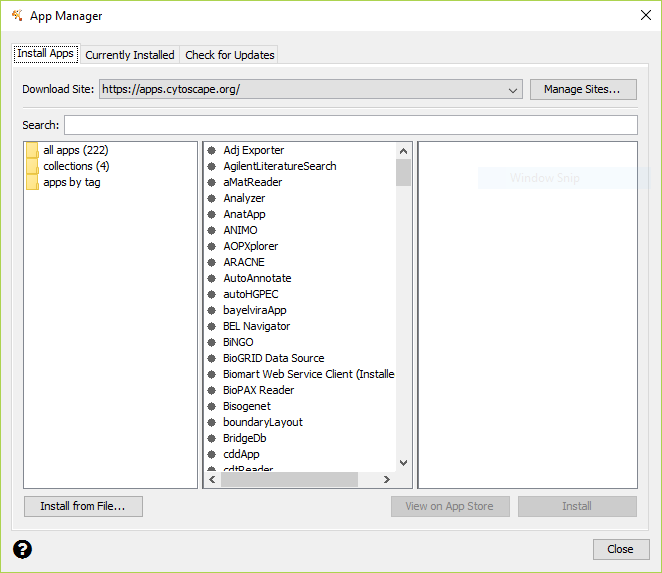

=====================
Installing OCSANA+
=====================
The OCSANA+ jar file can be downloaded from the OCSANA+ github repository
https://github.com/VeraLiconaResearchGroup/OCSANA_Plus/tree/master/OCSANA_Plus/target

To install apps within Cytoscape, go to the menu bar and choose **Apps →
App Manager...**. At the top of the **App Manager** window, make sure you
have the **Install Apps** tab selected.

You can install OCSANA+ by clicking the "Install from File" button on the bottom-left, and navigating to the downloaded folder.
